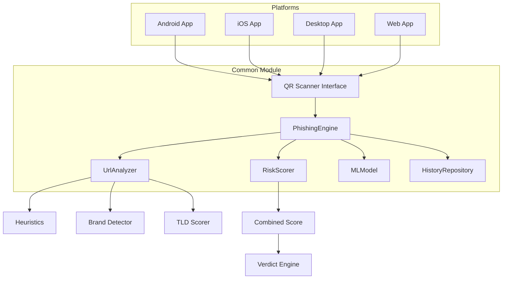

# 🛡️ QR-SHIELD MASTER PACK

## Complete Project Blueprint for Kotlin Multiplatform QRishing Detector

---

# 1. EXECUTIVE PROJECT OVERVIEW

## Problem Statement

QRishing (QR Code Phishing) represents one of the fastest-growing cyber threats. Attackers embed malicious URLs in QR codes placed on:
- Restaurant menus and parking meters
- Corporate email communications
- Fake delivery notifications
- Counterfeit payment portals

## Why QRishing is Rising (2025-2027)

| Trend | Impact |
|-------|--------|
| 587 attack increase since 2023 | Exponential growth in incidents |
| 71% of users skip URL verification | Low user awareness |
| Post-COVID QR adoption | Ubiquitous QR trust |
| Sophisticated brand spoofing | Harder to detect visually |

## Why Kotlin Multiplatform?

- **Single Codebase**: 80%+ code sharing across platforms
- **Native Performance**: Compiles to platform-specific binaries
- **Type Safety**: Kotlin's null safety prevents runtime crashes
- **Modern Tooling**: First-class IDE support, Compose UI
- **Industry Adoption**: Used by Netflix, McDonald's, VMware

## Value Proposition

For **Judges**: Demonstrates mastery of modern cross-platform development
For **Recruiters**: Production-ready architecture, security focus
For **Users**: Protection across all devices with single solution

---

# 2. FULL TECHNICAL ARCHITECTURE

## System Diagram (Mermaid)



## Module Breakdown

| Module | Package | Purpose |
|--------|---------|---------|
| commonMain | `com.qrshield.core` | Shared business logic |
| commonMain | `com.qrshield.engine` | Phishing analysis engine |
| commonMain | `com.qrshield.model` | Data models |
| androidMain | `com.qrshield.android` | Android camera integration |
| iosMain | `com.qrshield.ios` | iOS Vision integration |
| desktopMain | `com.qrshield.desktop` | JVM camera via OpenCV |
| webMain | `com.qrshield.web` | JS camera via MediaDevices |

## Data Flow

```
1. User scans QR code via platform camera
2. Platform-specific scanner extracts raw content
3. Content passed to shared UrlAnalyzer
4. UrlAnalyzer applies:
   - Structural analysis (domain, path, query)
   - Heuristic rules (25+ checks)
   - Brand impersonation detection
   - TLD risk assessment
5. MLModel performs inference on extracted features
6. RiskScorer combines all signals
7. VerdictEngine generates final assessment
8. Result displayed in Compose UI
9. Scan saved to local history (SQLDelight)
```

## Security Model

- **No Server Dependency**: All analysis on-device
- **Encrypted Storage**: AES-256 for history DB
- **No API Keys**: No external service dependencies
- **Minimal Permissions**: Camera only

---

# 3. DETAILED FEATURE SPECIFICATIONS

## QR Scanning Module

```kotlin
// Expected behavior across platforms
interface QrScanner {
    suspend fun scanFromCamera(): Flow<ScanResult>
    suspend fun scanFromImage(imageBytes: ByteArray): ScanResult
    fun stopScanning()
}

sealed class ScanResult {
    data class Success(val content: String) : ScanResult()
    data class Error(val message: String) : ScanResult()
    object NoQrFound : ScanResult()
}
```

## URL Analyzer Behavior

1. **Protocol Check**: HTTP vs HTTPS
2. **Domain Extraction**: Parse host from URL
3. **Subdomain Analysis**: Count and pattern
4. **Path Inspection**: Sensitive keywords
5. **Query Analysis**: Credential parameters
6. **Entropy Calculation**: Randomness scoring

## Heuristic Ruleset

| Rule | Weight | Description |
|------|--------|-------------|
| HTTP_NOT_HTTPS | 15 | No TLS/SSL |
| IP_ADDRESS_HOST | 20 | IP instead of domain |
| EXCESSIVE_SUBDOMAINS | 10 | >3 subdomain levels |
| SUSPICIOUS_TLD | 12 | High-risk TLDs |
| URL_SHORTENER | 8 | Redirect services |
| BRAND_IMPERSONATION | 25 | Brand name in subdomain |
| HOMOGRAPH_ATTACK | 30 | Unicode lookalikes |
| LONG_URL | 5 | >200 characters |
| CREDENTIAL_PARAMS | 18 | password, token in query |

---

# 4. COMPLETE PHISHING RISK ENGINE DESIGN

## A. URL Heuristics (Pseudocode)

```
FUNCTION analyzeUrl(url: String) -> HeuristicResult:
    score = 0
    flags = []
    
    parsed = parseUrl(url)
    
    IF parsed.protocol != "https":
        score += 15
        flags.add("HTTP_NOT_HTTPS")
    
    IF isIpAddress(parsed.host):
        score += 20
        flags.add("IP_ADDRESS_HOST")
    
    subdomainCount = countSubdomains(parsed.host)
    IF subdomainCount > 3:
        score += 10
        flags.add("EXCESSIVE_SUBDOMAINS")
    
    IF isSuspiciousTld(parsed.tld):
        score += 12
        flags.add("SUSPICIOUS_TLD")
    
    IF isUrlShortener(parsed.host):
        score += 8
        flags.add("URL_SHORTENER")
    
    brandMatch = detectBrandImpersonation(parsed.host)
    IF brandMatch != null:
        score += 25
        flags.add("BRAND_IMPERSONATION: " + brandMatch)
    
    IF detectHomograph(parsed.host):
        score += 30
        flags.add("HOMOGRAPH_ATTACK")
    
    IF url.length > 200:
        score += 5
        flags.add("LONG_URL")
    
    IF hasCredentialParams(parsed.query):
        score += 18
        flags.add("CREDENTIAL_PARAMS")
    
    RETURN HeuristicResult(score, flags)
```

## B. Suspicious Pattern Detection

```kotlin
object SuspiciousPatterns {
    val LOGIN_KEYWORDS = listOf(
        "login", "signin", "verify", "secure", "account",
        "update", "confirm", "banking", "password"
    )
    
    val URGENT_KEYWORDS = listOf(
        "urgent", "immediate", "suspend", "locked", "expire"
    )
    
    fun detectInPath(path: String): Int {
        var score = 0
        LOGIN_KEYWORDS.forEach { if (path.contains(it, true)) score += 5 }
        URGENT_KEYWORDS.forEach { if (path.contains(it, true)) score += 8 }
        return score
    }
}
```

## C. Brand Impersonation Fuzzy Matcher

```kotlin
object BrandDetector {
    private val BRANDS = mapOf(
        "paypal" to listOf("paypa1", "paypai", "paypaI", "pаypal"),
        "google" to listOf("g00gle", "googie", "goog1e"),
        "microsoft" to listOf("micr0soft", "rnicrosoft"),
        "amazon" to listOf("amaz0n", "arnazon"),
        "apple" to listOf("app1e", "appie")
    )
    
    fun detect(domain: String): BrandMatch? {
        val normalized = domain.lowercase()
        BRANDS.forEach { (brand, variants) ->
            if (normalized.contains(brand) && !isOfficialDomain(domain, brand))
                return BrandMatch(brand, "exact_in_subdomain")
            variants.forEach { variant ->
                if (normalized.contains(variant))
                    return BrandMatch(brand, "typosquat: $variant")
            }
        }
        return null
    }
}
```

## D. Domain Structure Scoring

```kotlin
fun scoreDomainStructure(host: String): Int {
    var score = 0
    val parts = host.split(".")
    
    // Excessive length
    if (host.length > 50) score += 10
    
    // Many subdomains
    if (parts.size > 4) score += 15
    
    // Random-looking subdomain (high entropy)
    parts.dropLast(2).forEach { subdomain ->
        if (calculateEntropy(subdomain) > 3.5) score += 12
    }
    
    // Numeric subdomain
    if (parts.any { it.all { c -> c.isDigit() } }) score += 8
    
    return score
}
```

## E. Path + Query Inspection

```kotlin
fun inspectPathAndQuery(url: URL): Int {
    var score = 0
    
    // Suspicious file extensions
    val riskyExtensions = listOf(".exe", ".scr", ".bat", ".cmd", ".ps1")
    riskyExtensions.forEach { 
        if (url.path.endsWith(it)) score += 25 
    }
    
    // Credential harvesting params
    val riskyParams = listOf("password", "pwd", "token", "session", "auth")
    riskyParams.forEach { param ->
        if (url.query?.contains(param, true) == true) score += 15
    }
    
    // Base64 encoded data in query
    if (url.query?.matches(Regex(".*[A-Za-z0-9+/=]{50,}.*")) == true) {
        score += 10
    }
    
    return score
}
```

## F. ML Model Design

### Feature Vector (15 dimensions)

```kotlin
data class UrlFeatures(
    val urlLength: Float,
    val hostLength: Float,
    val pathLength: Float,
    val subdomainCount: Float,
    val hasHttps: Float,        // 0 or 1
    val hasIpHost: Float,       // 0 or 1
    val domainEntropy: Float,
    val pathEntropy: Float,
    val queryParamCount: Float,
    val hasAtSymbol: Float,     // 0 or 1
    val numDots: Float,
    val numDashes: Float,
    val hasPortNumber: Float,   // 0 or 1
    val shortenerDomain: Float, // 0 or 1
    val suspiciousTld: Float    // 0 or 1
)
```

### Logistic Regression Inference

```kotlin
class LogisticRegressionModel(
    private val weights: FloatArray,
    private val bias: Float
) {
    fun predict(features: FloatArray): Float {
        require(features.size == weights.size)
        var z = bias
        for (i in features.indices) {
            z += weights[i] * features[i]
        }
        return sigmoid(z)
    }
    
    private fun sigmoid(x: Float): Float = 1.0f / (1.0f + exp(-x))
}
```

## G. Combined Risk Score Formula

```kotlin
fun calculateFinalScore(
    heuristicScore: Int,
    mlScore: Float,
    brandScore: Int,
    tldScore: Int
): RiskAssessment {
    val combined = (
        heuristicScore * 0.40 +
        (mlScore * 100) * 0.35 +
        brandScore * 0.15 +
        tldScore * 0.10
    ).toInt().coerceIn(0, 100)
    
    val verdict = when {
        combined <= 30 -> Verdict.SAFE
        combined <= 70 -> Verdict.SUSPICIOUS
        else -> Verdict.MALICIOUS
    }
    
    return RiskAssessment(combined, verdict)
}
```
